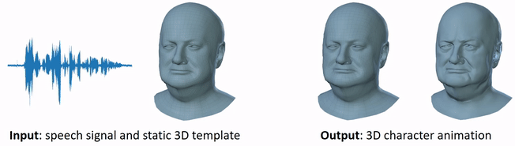

# VOCA: Voice Operated Character Animation

This is an official [VOCA](https://voca.is.tue.mpg.de) repository.

<p align="center"> 

</p>

VOCA is a simple and generic speech-driven facial animation framework that works across a range of identities. This codebase demonstrates how to synthesize realistic character animations given an arbitrary speech signal and a static character mesh. For details please see the scientific publication

```
Capture, Learning, and Synthesis of 3D Speaking Styles.
D. Cudeiro*, T. Bolkart*, C. Laidlaw, A. Ranjan, M. J. Black
Computer Vision and Pattern Recognition (CVPR), 2019
```

A pre-print of the publication can be found on the [project website](https://voca.is.tue.mpg.de).

## Video

See the demo video for more details and results.

[](https://youtu.be/XceCxf_GyW4)

## Set-up

The code uses Python 2.7 and it was tested on Tensorflow 1.12.0.

Install pip and virtualenv
```
sudo apt-get install python-pip python-virtualenv
```

Install ffmpeg
```
sudo apt install ffmpeg
```

Clone the git project:
```
$ git clone https://github.com/TimoBolkart/voca.git
```

Set up virtual environment:
```
$ mkdir <your_home_dir>/.virtualenvs
$ virtualenv --no-site-packages <your_home_dir>/.virtualenvs/voca
```

Activate virtual environment:
```
$ cd voca
$ source <your_home_dir>/voca/bin/activate
```

The requirements (including tensorflow) can be installed using:
```
pip install -r requirements.txt
```

Install mesh processing libraries from [MPI-IS/mesh](https://github.com/MPI-IS/mesh) within the virtual environment.


## Data

#### Data to run the demo 

Download the trained VOCA model, audio sequences, and template meshes from [MPI-IS/VOCA](https://voca.is.tue.mpg.de).<br/>
Download FLAME model from [MPI-IS/FLAME](http://flame.is.tue.mpg.de/).<br/>
Download the trained DeepSpeech model (v0.1.0) from [Mozilla/DeepSpeech](https://github.com/mozilla/DeepSpeech/releases/tag/v0.1.0) (i.e. deepspeech-0.1.0-models.tar.gz).

#### Data used to train VOCA

VOCA is trained on VOCASET, a unique 4D face dataset with about 29 minutes of 4D scans captured at 60 fps and synchronized audio from 12 speakers that can be downloaded at [MPI-IS/VOCASET](https://voca.is.tue.mpg.de). 

Training subjects:
```
FaceTalk_170728_03272_TA, FaceTalk_170904_00128_TA, FaceTalk_170725_00137_TA, FaceTalk_170915_00223_TA, FaceTalk_170811_03274_TA, FaceTalk_170913_03279_TA, FaceTalk_170904_03276_TA, FaceTalk_170912_03278_TA
```
This is also the order of the subjects for the one-hot-encoding (i.e. FaceTalk_170728_03272_TA: 0, FaceTalk_170904_00128_TA: 1, ...)

Validation subjects:
```
FaceTalk_170811_03275_TA, FaceTalk_170908_03277_TA
```

Test subjects:
```
FaceTalk_170809_00138_TA, FaceTalk_170731_00024_TA 
```

## Demo

We provide demos i) to synthesize a character animation given an speech signal (VOCA), ii) to alter identity dependent face shape and head pose of an animation sequence using FLAME, and iii) to generate templates (e.g. by sampling the [FLAME](http://flame.is.tue.mpg.de/) identity shape space, or by reconstructing a template from an image using [RingNet](https://github.com/soubhiksanyal/RingNet) that can be animated with VOCA. 

##### VOCA output

This demo runs VOCA, which outputs animation sequences for audio sequences.
```
python run_voca.py --tf_model_fname './model/gstep_52280.model' --ds_fname './ds_graph/output_graph.pb' --audio_fname './audio/test_sentence.wav' --template_fname './template/FLAME_sample.ply' --condition_idx 3 --out_path './animation_output'
```

##### Render sequence

This demo renders the animation sequence to a video.
```
python visualize_sequence.py --sequence_path './animation_output' --audio_fname './audio/test_sentence.wav' --out_path './animation_visualization'
```

##### Edit VOCA output

VOCA outputs meshes in FLAME topology. This demo shows how to use FLAME to edit the identity dependent face shape or head pose of an animation sequence generated by VOCA.

Edit identity-dependent shape:
```
python edit_sequences.py --source_path './animation_output' --out_path './FLAME_variation_shape' --flame_model_path  './flame/generic_model.pkl' --mode shape --index 0 --max_variation 3
```

Edit head pose:
```
python edit_sequences.py --source_path './animation_output' --out_path './FLAME_variation_pose' --flame_model_path  './flame/generic_model.pkl' --mode pose --index 3 --max_variation 0.52
```

##### Sample template

VOCA animates static templates in FLAME topology. Such templates can be obtained by fitting FLAME to scans, images, or by sampling the FLAME shape space. This demo randomly samples the FLAME identity shape space to generate new templates.
```
python sample_templates.py --flame_model_path './flame/generic_model.pkl' --num_samples 1 --out_path './template'
```

##### Reconstruct template from images

[RingNet](https://ringnet.is.tue.mpg.de/) is a framework to fully automatically reconstruct 3D meshes in FLAME topology from an image. After removing effects of pose and expression, the RingNet output mesh can be used as VOCA template. Please see the RingNet [demo](https://github.com/soubhiksanyal/RingNet) on how to reconstruct a 3D mesh from an image with neutralized pose and expression.

## Known issues

The [MPI-IS/mesh](https://github.com/MPI-IS/mesh) to date does not support Python 3. Due to the dependency on the mesh package, VOCA uses Python 2.7.

If you get an error like
```
ModuleNotFoundError: No module named 'psbody'
```
please check if the [MPI-IS/mesh](https://github.com/MPI-IS/mesh) is successfully installed within the virtual environment.

## License

Free for non-commercial and scientific research purposes. By using this code, you acknowledge that you have read the license terms (https://voca.is.tue.mpg.de/license), understand them, and agree to be bound by them. If you do not agree with these terms and conditions, you must not use the code.


## Referencing VOCA

When using this code, please cite VOCA. You find the most up to date bibliographic information at https://voca.is.tue.mpg.de.


## Acknowledgement

We thank Raffi Enficiaud and Ahmed Osman for pushing the release of psbody.mesh.


